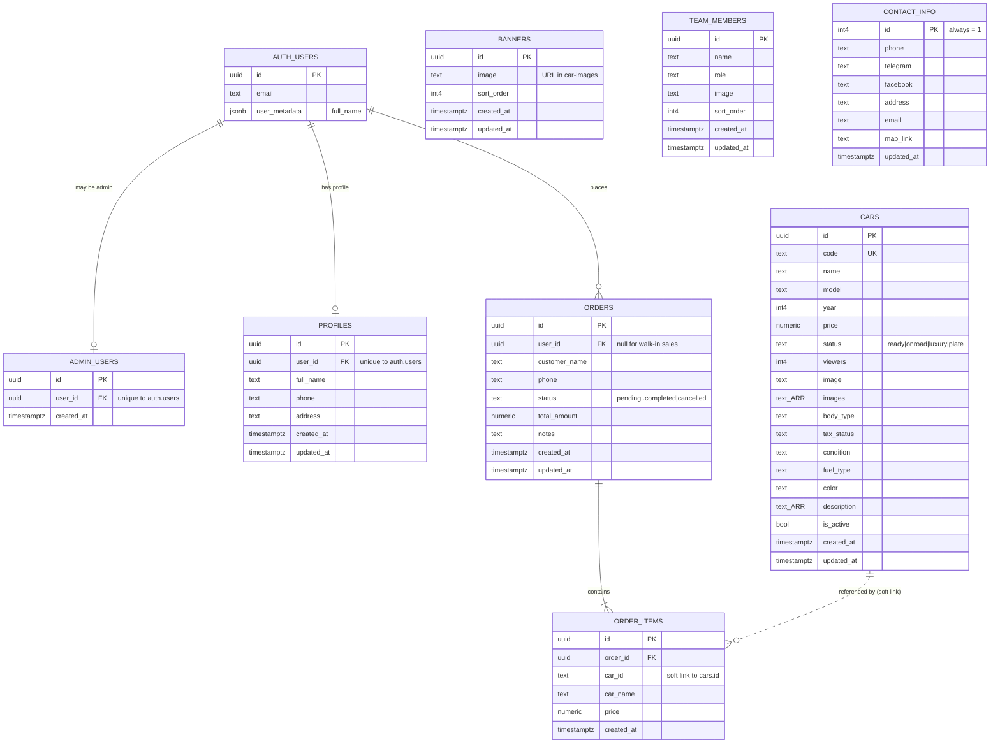

# Car Plus — Database Schema (ER Diagram)

The Supabase/Postgres schema behind the Car Plus site: **8 tables** plus Supabase's
built-in authentication. Sales flow through `orders` → `order_items`; the rest of
the content tables are independent and admin-edited.

> **Legend:** `PK` primary key · `FK` foreign key · `UK` unique

## Tables at a glance

| Table | Purpose | Notable columns |
|---|---|---|
| **cars** | Vehicle inventory shown on the site | `code` (unique), `price`, `status`, `images[]`, `description[]`, `is_active` |
| **orders** | A sale — placed by a customer or recorded by an admin | `user_id` (null for walk-ins), `customer_name`, `phone`, `status`, `total_amount` |
| **order_items** | Line items on an order (the car sold) | `order_id`, `car_id`, `car_name`, `price` |
| **banners** | Rotating hero images (admin-editable) | `image` (URL), `sort_order` |
| **team_members** | "Meet our team" cards | `name`, `role`, `image`, `sort_order` |
| **contact_info** | Site contact details — a single row (`id` = 1) | `phone`, `telegram`, `facebook`, `map_link` |
| **profiles** | Optional customer details from the Profile page | `user_id`, `full_name`, `phone`, `address` |
| **admin_users** | Who has admin access | `user_id` → `auth.users` |
| **auth.users** | Supabase-managed accounts (login) | `email`, `user_metadata` |

## Relationships & rules

- **Admin access:** `admin_users.user_id → auth.users.id`, **unique** — an account either
  is an admin or isn't. The `is_admin()` function reads this table to gate the dashboard
  and every admin write policy.
- **Profiles:** `profiles.user_id → auth.users.id`, **unique** — at most one profile per
  account. Each user reads and writes only their own row.
- **Orders:** `orders.user_id → auth.users.id` is **nullable** on purpose. A logged-in
  customer places an order (their id is set); an admin recording a walk-in sale leaves it
  null and fills `customer_name`/`phone` instead.
- **Order items:** `order_items.order_id → orders.id` with `ON DELETE CASCADE` — deleting
  an order removes its items. `car_id` is **TEXT, not a foreign key**, so an order keeps
  its history even if that car listing is later deleted; `car_name` and `price` are copied
  in at sale time for the same reason.
- **Content tables are independent.** `cars`, `banners`, `team_members`, and
  `contact_info` have no foreign keys between them — each is edited on its own.
- **Photos live in Storage, not the tables.** The `image` / `images` columns store **URLs**
  pointing to the `car-images` storage bucket — a soft link by string, not a database
  foreign key. (Deleting the Supabase project destroys those files even though the rows
  survive.)
- **contact_info is a single row.** Its `id` is always `1` (a CHECK constraint enforces
  it), so the app updates that one row rather than inserting new ones.
- **Row-Level Security.** Anyone can *read* active cars, banners, team, and contact; only
  admins can *write*. Customers see only their own orders and profile; admins see all.
  The wishlist isn't a table — it's stored in the browser's localStorage.

---

_8 tables · Supabase Postgres · `car-images` storage bucket._
