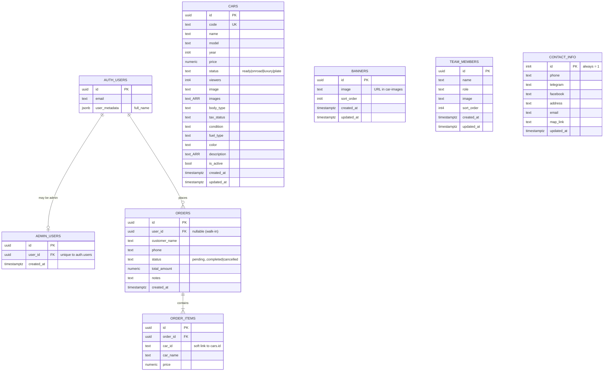

# Car Plus — Database Schema (ER Diagram)

The Supabase/Postgres schema behind the Car Plus site: **5 content tables** plus
Supabase's built-in authentication. The content tables stand alone — the only true
relationship links an admin record back to an auth user.

> **Legend:** `PK` primary key · `FK` foreign key · `UK` unique

## Tables at a glance

| Table | Purpose | Notable columns |
|---|---|---|
| **cars** | Vehicle inventory shown on the site | `code` (unique), `price`, `status`, `images[]`, `description[]`, `is_active` |
| **banners** | Rotating hero images (admin-editable) | `image` (URL), `sort_order` |
| **team_members** | "Meet our team" cards | `name`, `role`, `image`, `sort_order` |
| **contact_info** | Site contact details — a single row (`id` = 1) | `phone`, `telegram`, `facebook`, `map_link` |
| **admin_users** | Who has admin access | `user_id` → `auth.users` |
| **auth.users** | Supabase-managed accounts (login) | `email`, `user_metadata` |

## Relationships & rules

- **The one relationship:** `admin_users.user_id → auth.users.id`. It's **unique**, so each
  account maps to at most one admin record — a user either is an admin or isn't. The
  `is_admin()` function reads this table to gate the dashboard.
- **Content tables are independent.** `cars`, `banners`, `team_members`, and `contact_info`
  have no foreign keys between them — each is edited on its own.
- **Photos live in Storage, not the tables.** The `image` / `images` columns store **URLs**
  pointing to the `car-images` storage bucket — a soft link by string, not a database foreign
  key. (This is why deleting the old project broke the photos: the URLs pointed at storage
  that no longer exists.)
- **contact_info is a single row.** Its `id` is always `1` (a CHECK constraint enforces it),
  so the app updates that one row rather than inserting new ones.
- **Row-Level Security.** Anyone can *read* active cars, banners, team, and contact; only
  admins can *write*. The wishlist isn't a table — it's stored in the browser's localStorage.

---

_5 tables · 1 relationship · Supabase Postgres · `car-images` storage bucket._
